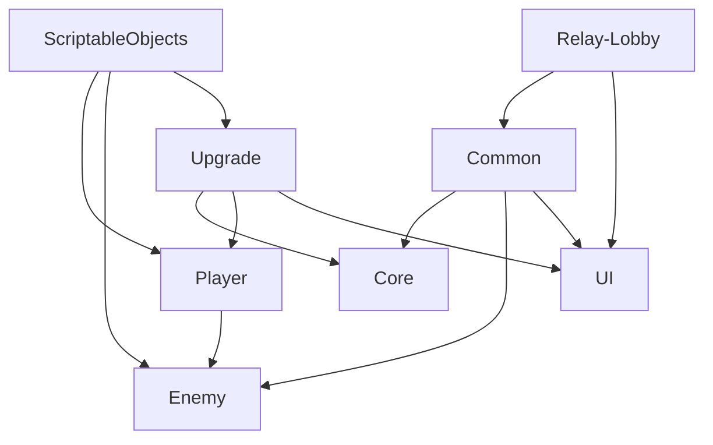

# Script Architecture

## 1. 全体像

このプロジェクトのスクリプト構成は、責務ごとに比較的明確に分割されています。

- Common: 汎用基盤
- Core: 防衛対象の中核
- Player: プレイヤーとリンク
- Enemy: 敵の行動と生成
- Upgrade: アップグレード進行管理
- ScriptableObjects: データ定義
- Relay-Lobby: オンラインセッション制御
- UI: 表示層
- Interface: 契約定義

この分割は、そのまま保守単位と拡張単位になっています。

## 2. ディレクトリごとの意味

### 2.1 Common

主要ファイル:

- `Assets/Scripts/Common/HealthBase.cs`
- `Assets/Scripts/Common/GlobalCommon.cs`
- `Assets/Scripts/Common/Loader/SceneLoaderManager.cs`
- `Assets/Scripts/Common/AudioManager.cs`

意味:

- 特定ゲーム要素に閉じない共通基盤を置く層
- 他システムが依存してもよい下位層

拡張性:

- ステータス基盤
- ロード進行 UI
- 汎用エフェクト管理
- BGM / SE 管理

### 2.2 Core

主要ファイル:

- `Assets/Scripts/Core/Health.cs`
- `Assets/Scripts/Core/CoreController.cs`

意味:

- ゲーム敗北条件に関わる中心オブジェクトを担当

拡張性:

- 防衛対象が複数存在するモード
- Core スキル
- Core シールドや復旧機能

### 2.3 Player

主要ファイル:

- `Assets/Scripts/Player/Movement.cs`
- `Assets/Scripts/Player/Attack.cs`
- `Assets/Scripts/Player/FollowCamera.cs`
- `Assets/Scripts/Player/Link/LinkController.cs`
- `Assets/Scripts/Player/Link/Link.cs`
- `Assets/Scripts/Player/Link/LinkRuntimeStats.cs`

意味:

- プレイヤーの行動とリンク戦闘の中核層

拡張性:

- 新しい移動方式
- プレイヤー固有能力
- リンク属性差分
- プレイヤー状態異常

### 2.4 Enemy

主要ファイル:

- `Assets/Scripts/Enemy/EnemyController.cs`
- `Assets/Scripts/Enemy/EnemySpawnController.cs`
- `Assets/Scripts/Enemy/GetTarget.cs`
- `Assets/Scripts/Enemy/Attack.cs`

意味:

- 敵の個体制御と敵群生成を扱う層

拡張性:

- ボス AI
- 特殊移動
- 行動ステートマシン
- 敵固有 ScriptableObject

### 2.5 Upgrade

主要ファイル:

- `Assets/Scripts/Upgrade/UpgradeManager.cs`
- `Assets/Scripts/Upgrade/UpgradeState.cs`
- `Assets/Scripts/Upgrade/UpgradeContext.cs`

意味:

- アップグレード進行の調停層
- データ定義に依存するが、効果内容は持たない層

拡張性:

- レアリティ
- シナジー
- 再抽選
- プレイヤー別ビルド

### 2.6 ScriptableObjects

主要ファイル:

- `Assets/Scripts/ScriptableObjects/PlayerConfig.cs`
- `Assets/Scripts/ScriptableObjects/EnemySpawnConfig.cs`
- `Assets/Scripts/ScriptableObjects/UpgradeDefinition.cs`
- `Assets/Scripts/ScriptableObjects/UpgradeElements/UpgradeDatabase.cs`

意味:

- データ定義層
- バランス調整とコンテンツ追加をコード変更から分離する層

拡張性:

- プレイヤークラス設定
- 武器定義
- 敵定義
- ステージ定義

### 2.7 Relay-Lobby

主要ファイル:

- `Assets/Scripts/Relay-Lobby/LobbyManager.cs`
- `Assets/Scripts/Relay-Lobby/LobbyApiClient.cs`
- `Assets/Scripts/Relay-Lobby/RelayTest.cs`
- `Assets/Scripts/Relay-Lobby/NetcodeSceneTransitionCoordinator.cs`

意味:

- オンラインセッションの入口と実接続を司る層

拡張性:

- ルーム設定追加
- マッチメイキング
- 再接続
- 切断復帰

### 2.8 UI

主要ファイル:

- `Assets/Scripts/UI/Upgrade/UpgradeModuleController.cs`
- `Assets/Scripts/UI/Upgrade/Module/SelectUpgradeElement.cs`
- `Assets/Scripts/UI/ApplyDamageUI.cs`
- `Assets/Scripts/UI/TestUIManager.cs`

意味:

- 表示専用または表示に近い層

拡張性:

- HUD
- リザルト
- ミニマップ
- マルチプレイ状況表示

## 3. 依存関係の大きな流れ



補足:

- ScriptableObjects は下位依存される設定層
- Common は広く参照される基盤層
- Upgrade は Core と Player の実体に作用するが、処理自体は定義へ委譲
- Lobby はゲームプレイそのものではなく、セッション制御層

## 4. 主要クラスの責務

### 4.1 HealthBase

責務:

- 体力状態管理
- 最大体力 modifier 反映
- ダメージ受付の共通入口
- 死亡演出通知

このクラスの価値:

- 体力系ロジックを継承で再利用できる
- Core、Enemy、将来の Player 本体などに拡張しやすい

### 4.2 LinkController

責務:

- プレイヤー検出
- リンクの生成管理
- リンク維持と破断
- 重複リンク防止

このクラスの価値:

- リンク生成責務が 1 箇所に集約される
- 演出とライフサイクルが一貫する

拡張するなら:

- 距離以外の接続条件
- 色分けや属性差分
- 特定組み合わせだけの特殊リンク

### 4.3 LinkRuntimeStats

責務:

- リンク攻撃力のランタイム管理
- 固定値 modifier と割合 modifier の集約

このクラスの価値:

- PlayerConfig を直接書き換えず、実行時ステータスだけを集約できる
- アップグレードと一時バフが同じ仕組みに乗る

### 4.4 UpgradeManager

責務:

- 候補選出
- UI 連携
- 選択収集
- 適用タイミング管理

このクラスの価値:

- 効果定義を知らず、進行管理に専念できる
- 定義追加時に manager 側の分岐を増やさずに済む

### 4.5 LobbyManager

責務:

- Lobby UI 要求の受け口
- サービス初期化
- ロビー状態管理
- 開始条件管理

このクラスの価値:

- ロビーの制御フローが 1 箇所で追える
- API 呼び出し責務が補助クラスへ分かれており、肥大化しにくい

### 4.6 RelayTest

責務:

- Relay セッション構築
- Host / Client 起動
- Battle 到達後の PlayerObject 補完生成

このクラスの価値:

- Netcode 起動とプレイヤー出現タイミングを制御できる
- Lobby と Battle の境界をまたぐ役割を持つ

## 5. スクリプト間の依存関係を処理フローで見る

### 5.1 バトル開始まで

```text
LobbyEventHandler
  -> LobbyManager
  -> RelayTest
  -> NetcodeSceneTransitionCoordinator
  -> Load
  -> SceneLoaderManager
  -> Battle
```

### 5.2 バトル中の主ループ

```text
EnemySpawnController
  -> Enemy prefab spawn
  -> EnemyController update
  -> GetTarget / Movement / Attack

LinkController
  -> CollectPlayers
  -> pair detection
  -> Link spawn / update / break
  -> Player Attack
  -> IDamageable.ApplyDamage

UpgradeManager
  -> offer selection
  -> UI display
  -> apply UpgradeDefinition
  -> Core.Health or LinkRuntimeStats update
```

## 6. 拡張性の観点から見た優れている点

### 6.1 データ駆動

PlayerConfig、EnemySpawnConfig、UpgradeDefinition によって、主要バランス要素の一部がコード外へ出ています。これは拡張性の観点で非常に重要です。

### 6.2 責務分離

UpgradeManager が効果内容を直接持たず、Relay-Lobby 群が戦闘コードから分離されているため、修正範囲が局所化しやすいです。

### 6.3 共有ランタイムステート

`LinkRuntimeStats` のような実行時専用ステータス層があるため、恒久設定と一時効果を分離できます。これは将来的に武器、バフ、デバフ、装備などを入れる際に有効です。

## 7. 将来のためにさらに分離すると良い箇所

### 7.1 Player 収集方法

現在の `LinkController` は `Movement` の探索に依存しています。今後プレイヤー定義が増えるなら、Player 登録管理クラスを別に持つとより堅くなります。

### 7.2 UpgradeContext の拡張

今は CoreHealth と LinkRuntimeStats が中心ですが、プレイヤー移動速度、敵制御、スコア、ドロップ率などを追加する余地があります。

### 7.3 敵 AI の状態管理

現状はシンプルで追いやすい反面、行動が増えると EnemyController が肥大化しやすいです。将来はステートマシンや Behaviour Tree 化も選択肢です。

## 8. 保守時に意識したいこと

- Common を便利箱にしすぎない
- ScriptableObject にランタイム状態を書き込まない
- Netcode の権限境界を崩さない
- シーン遷移は Load を前提に考える
- UI 表示用データとゲーム本体データを混ぜない

## 9. 総評

現在の構成は、規模が大きくなっても耐えやすい方向に進み始めています。特に、リンク、アップグレード、ロビー導線の 3 系統がそれぞれ独立した責務で整理されているため、今後の開発でも破綻しにくい設計です。